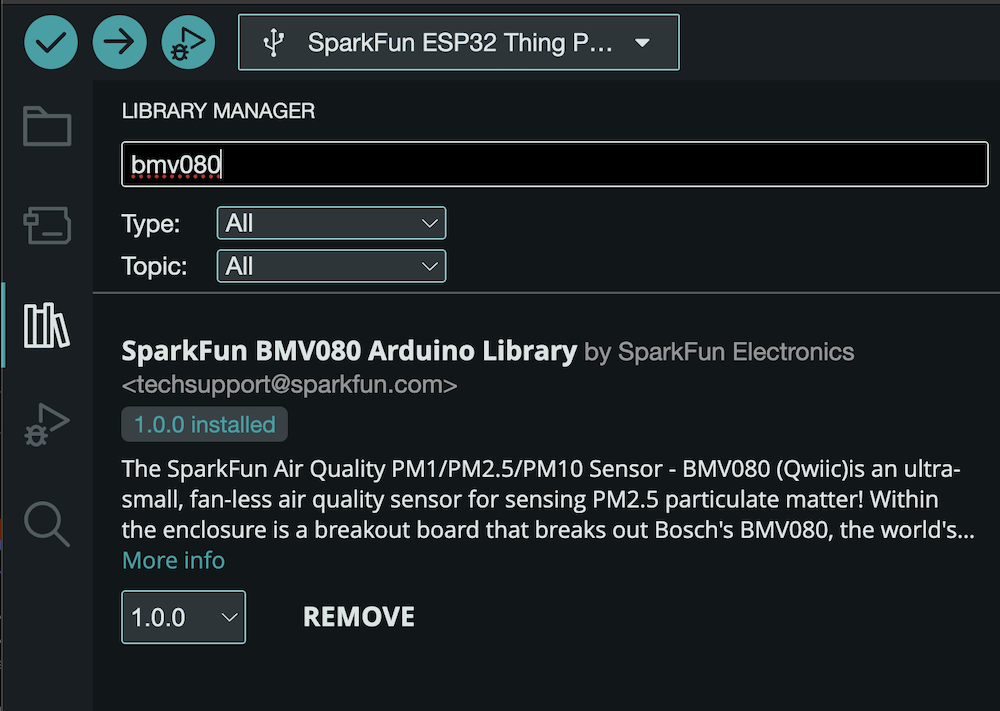

")

# SparkFun Air Quality PM1/PM2.5/PM10 Sensor - BMV080 (Qwiic)

Arduino Library for the SparkFun Air Quality PM1/PM2.5/PM10 Sensor - BMV080


The [SparkFun Air Quality PM1/PM2.5/PM10 Sensor - BMV080 (Qwiic)](https://www.sparkfun.com/sparkfun-air-quality-pm1-pm2-5-pm10-sensor-bmv080-qwiic.html)is an ultra-small, fan-less air quality sensor for sensing PM2.5 particulate matter! Within the enclosure is a breakout board that breaks out Bosch's BMV080, the world's smallest PM1 and PM2.5 air quality sensor. The sensing element measures merely 4.2mm x 3.5mm x 3.1mm (W x L x H), which is more than 450 times smaller than any comparable device on the market. The innovative design is based on ultra-compact lasers with integrated photodiodes. The sensor applies sophisticated algorithms to measure PM1 and PM2.5 concentrations directly in free space, without requiring an intrusive fan.

The breakout board comes with the BMV080 populated and takes advantage of its flexible cable with the FPC 13-pin 0.33mm connector. On the back of the board is a horizontal Qwiic connector to reduce the amount of soldering on the board. However, the board still breaks out 0.1"-spaced pins for users who prefer a soldered connection or prototyping the pins on a breadboard. The breakout also includes four jumper selectable I2C addresses if you happen to connect more than one BMV080 on the same I2C port. While the breakout was designed for I2C by default, you can also configure the board's jumper to communicate over SPI as well. A special lens allows the laser to pass through the enclosure to take measurements.

> [!NOTE]
> To use this library, the Bosch BMV080 SDK must be downloaded from Bosch, and some files copied over into this library once it's installed. Details of this are outlined below [here](#install-the-bosch-sdk).
>
> If the SDK files are not copied into this library, this library will fail to build.
> 
> This library has been verified with the following versions:
> SparkFun_BMV_Arduino_Library v1.0.1
> Bosch BMV080 SDK v11.0.0
> Arduino IDE 2.3.5
>
> Architectures Supported/Verified:
> esp32 ([SparkFun Thing Plus - ESP32 WROOM (USB-C)](https://www.sparkfun.com/sparkfun-thing-plus-esp32-wroom-usb-c.html))
> esp32s2 ([SparkFun Thing Plus - ESP32-S2 WROOM](https://www.sparkfun.com/sparkfun-thing-plus-esp32-s2-wroom.html))
> m33f ([SparkFun Thing Plus - RA6M5](https://www.sparkfun.com/sparkfun-thing-plus-ra6m5.html))

## Functionality

The Air Quality PM1/PM2.5/PM10 Sensor - BMV080  can run as an I2C client device, or as a SPI client device. Once connected, the library allows the collaction of PM1, PM2.5 and PM10 readings as well as if the sensor is obstructed.

The library enables setting a variety of sensor settings, properties and operating conditions.

> [!NOTE]
>
> This library uses an pre-compiled archive library provided by Bosch, which is linked to this Arduino library and build time. As such, board support is limited to platforms the Bosch library supports.
>
> Consult the architecture directories in the [src](src/) folder of this library. Additional information is available from the [Bosch BMV080 SDK Documentation](https://www.bosch-sensortec.com/products/environmental-sensors/particulate-matter-sensor/bmv080/#documents).

## Documentation

|Reference | Description |
|---|---|
|[Quick Reference](https://docs.sparkfun.com/SparkFun_BMV080_Arduino_Library/classsf_dev_b_m_v080.html)| A quick reference API for the the main library object ```sfDevBMV080```|
|[Full Documentation](https://docs.sparkfun.com/SparkFun_BMV080_Arduino_Library/)| The full documentation and API for this Arduino library|
|[SparkFun Air Quality PM1/PM2.5/PM10 Sensor - BMV080](https://github.com/sparkfun/SparkFun_Particulate_Matter_Sensor_Breakout_BMV080)| Hardware GitHub Repository|
|[Hook Up Guide](https://docs.sparkfun.com/SparkFun_Particulate_Matter_Sensor_Breakout_BMV080) | Hardware Overview and Quick Start for the Air Quality Sensor - BMV080 |

## Examples

The following examples are provided with the library

| Example | Description |
|---|---|
|[Basic Readings](examples/Example_01_BasicReadings/Example_01_BasicReadings.ino)| The sensor is initialized, and the values for PM1, PM2.5 and PM10 are output to the console.|
|[Duty Cycle](examples/Example_02_DutyCycle/Example_02_DutyCycle.ino)| The sensor is placed in a 20 second Duty Cycle mode - with PM 2.5 values read and output every 20 seconds|
|[Interruput](examples/Example_03_Interrupt/Example_03_Interrupt.ino)|Readings are driven by a sensor Interrupt|
|[SPI](examples/Example_04_SPI/Example_04_SPI.ino)|The sensor is connected to using an SPI connection|
|[Set/Get Parameters](examples/Example_05_Parameters/Example_05_Parameters.ino)|Shows how to set and get sensor prameters using the library|
|[Two Sensors](examples/Example_06_TwoSensors/Example_06_TwoSensors.ino)|Shows how two sensors can operate using the same system|
|[Demo Alphanumeric](examples/Example_07_Demo_Alphanumeric/Example_07_Demo_Alphanumeric.ino)|A demo script that outputs sensed data to an Alpha Numeric display|
|[Demo - OLED](examples/Example_08_Demo_Oled/Example_08_Demo_Oled.ino)| Demo that outputs sensor information to a connected OLED display|
|[Open - Close](examples/Example_09_OpenClose/Example_09_OpenClose.ino)|Shows how to open the sensor, take a set of readings and then close the sensor|

## Install the Bosch SDK

To use this library with SparkFun BMV080 Air Quality Sensor, the Bosch SDK for the BMV080 must be installed and files copied into the correct locations within this library.

The following outlines how to install the library.

### Install this library

Using the Arduino Library Manager, install this library.



## Download the Bosch BMV080 SDK

The SDK is avilable [on this page](https://www.bosch-sensortec.com/products/environmental-sensors/particulate-matter-sensor/bmv080/#documents). Select the 'Download the SDK for BMV080` link/button.

Once downloaded, unzip the file.

## Copy Files

Files from the SDK must be copied into the installation of this library. This, the SparkFun BMV080 Arduino library, is installed in the following locations:

### Library Install Directory

| OS | Directory|
|---|---|
|macOS | $HOME/Documents/Arduino/libraries/SparkFun_BMV080_Arduino_Library|
|Windows | $HOME\Documents\Arduino\libraries\SparkFun_BMV080_Arduino_Library|
|Linux| $HOME/Arduino/libraries/SparkFun_BMV080_Arduino_Library|

### Files to copy and locations to copy to

From the Bosch SDK, the following files are copied into the specified library locations.

|Bosch SDK File | SparkFun BMV080 Arduino Library Directory|
|--|--|
|api/inc/bmv080.h| src/sfTk/bmv080.h|
|api/inc/bmv080_defs.h| src/sfTk/bmv080_defs.h|
|api/api/lib/xtensa_esp32/xtensa_esp32_elf_gcc/release/lib_bmv080.a | src/esp32/lib_bmv080.a|
|api/api/lib/xtensa_esp32/xtensa_esp32_elf_gcc/release/lib_postProcessor.a | src/esp32/lib_postProcessor.a|
|api/api/lib/xtensa_esp32s2/xtensa_esp32s2_elf_gcc/release/lib_postProcessor.a | src/esp32s2/lib_postProcessor.a|
|api/api/lib/xtensa_esp32s2/xtensa_esp32s2_elf_gcc/release/lib_bmv080.a | src/esp32s2/lib_bmv080.a|
|api/api/lib/xtensa_esp32s3/xtensa_esp32s3_elf_gcc/release/lib_postProcessor.a | src/esp32s3/lib_postProcessor.a|
|api/api/lib/xtensa_esp32s3/xtensa_esp32s3_elf_gcc/release/lib_bmv080.a | src/esp32s3/lib_bmv080.a|
|api/api/lib/arm_cortex_m0plus/xarm_none_eabi_gcc/release/lib_postProcessor.a | src/cortex-m0plus/lib_postProcessor.a|
|api/api/lib/arm_cortex_m0plus/arm_none_eabi_gcc/release/lib_bmv080.a | src/cortex-m0plus/lib_bmv080.a|
|api/api/lib/arm_cortex_m33f/xarm_none_eabi_gcc/release/lib_postProcessor.a | src/cortex-m33/lib_postProcessor.a|
|api/api/lib/arm_cortex_m33f/arm_none_eabi_gcc/release/lib_bmv080.a | src/cortex-m33/lib_bmv080.a|
|api/api/lib/arm_cortex_m4/xarm_none_eabi_gcc/release/lib_postProcessor.a | src/cortex-m4/lib_postProcessor.a|
|api/api/lib/arm_cortex_m4/arm_none_eabi_gcc/release/lib_bmv080.a | src/cortex-m4/lib_bmv080.a|
|api/api/lib/arm_cortex_m4f/xarm_none_eabi_gcc/release/lib_postProcessor.a | src/cortex-m4f/lib_postProcessor.a|
|api/api/lib/arm_cortex_m4f/arm_none_eabi_gcc/release/lib_bmv080.a | src/cortex-m4f/lib_bmv080.a|

Once the files are copied into place, this library is available for use.

## License Information

This product is ***open source***!

This product is licensed using the [MIT Open Source License](https://opensource.org/license/mit).
